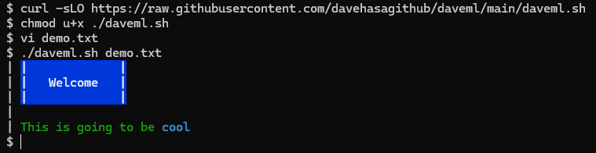

# DaveML

Possibly the dumbest project on GitHub.

Create a file `demo.txt`, such as:

```text
<BBG>|             |
<BBG>|   Welcome   |
<BBG>|             |

<GGG>This is going to be <CCC>cool
```

Run `daveml.sh demo.txt` or `cat demo.txt|daveml.sh`,
and it will convert the tags to ANSI color escape codes.
Maybe useful, for example, when showing a motd (message of the day).
Tags are subject to change!

To use locally:
```bash
curl -sLO https://raw.githubusercontent.com/davehasagithub/daveml/main/daveml.sh
chmod u+x ./daveml.sh
```

To install globally:
```bash
sudo curl -sL -o /usr/local/bin/daveml.sh https://raw.githubusercontent.com/davehasagithub/daveml/main/daveml.sh
sudo chmod 755 /usr/local/bin/daveml.sh
sudo bash -c 'echo "alias daveml=\"/usr/local/bin/daveml.sh\"" >/etc/profile.d/daveml-alias.sh'
#sign out and back in for the alias to take effect
```


