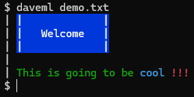

# DaveML



> Possibly the dumbest project on GitHub. :)
>
> Instead, you probably want to
> [try](https://stackoverflow.com/questions/7851134/syntax-highlighting-colorizing-cat)
> something like: `bat`, `ccat`, `pygmentize`, or `highlight`.

Create a file `demo.txt`, such as:

```text
<WBB>|             |
<WBB>|   Welcome   |
<WBB>|             |

<GXX>This is going to be <CXX>cool <RBX>!!!
```

Run `daveml.sh demo.txt` or `cat demo.txt|daveml.sh`,
and it will convert the tags to ANSI color escape codes.
Maybe useful, for example, when showing a motd (message-of-the-day).

Color codes are: &lt;foreground&gt; &lt;bold or X&gt; &lt;background or X&gt;

> K = black, R = red, G = green, Y = yellow, B = blue
> M = magenta, C = cyan, W = white, X = default

This does not include support for italic, underline, or strikethrough.

To use locally:
```bash
curl -sLO https://raw.githubusercontent.com/davehasagithub/daveml/main/daveml.sh
chmod u+x ./daveml.sh
```

To install globally:
```bash
sudo curl -sL -o /usr/local/bin/daveml.sh https://raw.githubusercontent.com/davehasagithub/daveml/main/daveml.sh
sudo chmod 755 /usr/local/bin/daveml.sh
sudo bash -c 'echo "alias daveml=\"/usr/local/bin/daveml.sh\"" >/etc/profile.d/daveml-alias.sh'
#sign out and back in for the alias to take effect
```
